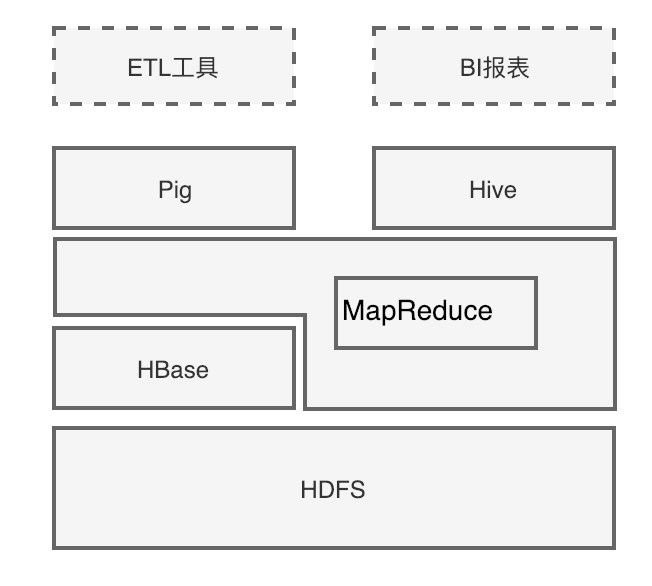
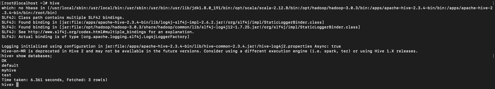

# Hive技术原理&HQL

本文有两个主旨：
1. 讲解Hive的运行原理，帮助使用者更好的了解在使用的过程中它做了些什么工作，深入的理解他的工作机制，提高开发人员理论层面的知识
2. 讲解Hive的HQL语言，帮助使用者了解HQL语言的使用，能够利用HQL进行简单的查询分析

<!-- TOC -->

- [Hive技术原理&HQL](#hive技术原理hql)
    - [Hive概述](#hive概述)
        - [数据仓库的概念](#数据仓库的概念)
        - [传统数据仓库面临的挑战](#传统数据仓库面临的挑战)
        - [Hive简介](#hive简介)
        - [Hive与Hadoop生态系统中其他组件的关系](#hive与hadoop生态系统中其他组件的关系)
        - [Hive的优缺点](#hive的优缺点)
        - [Hive与传统数据库的对比分析](#hive与传统数据库的对比分析)
        - [Hive的架构](#hive的架构)
        - [Hive的数据组织](#hive的数据组织)
    - [Hive的基本使用](#hive的基本使用)
        - [Hive的安装](#hive的安装)
        - [HQL基本使用](#hql基本使用)
            - [1.创建数据库](#1创建数据库)
            - [2.使用新的数据库](#2使用新的数据库)
            - [3.查看当前正在使用的数据库](#3查看当前正在使用的数据库)
            - [4.在数据库myhive创建一张student表](#4在数据库myhive创建一张student表)
            - [5.往表中加载数据](#5往表中加载数据)
            - [6.查询数据](#6查询数据)
            - [7.查看表结构](#7查看表结构)
    - [Hive连接](#hive连接)
        - [CLI连接](#cli连接)
        - [HiveServer2/beeline连接](#hiveserver2beeline连接)
    - [Hive SQL数据类型和存储格式](#hive-sql数据类型和存储格式)
        - [1.数据类型](#1数据类型)
            - [基本数据类型](#基本数据类型)
            - [复杂类型](#复杂类型)
        - [2. 存储格式](#2-存储格式)
            - [textfile](#textfile)
            - [SequenceFile](#sequencefile)
            - [RCFile](#rcfile)
            - [ORCFile](#orcfile)
            - [Parquet](#parquet)
        - [3. 数据格式](#3-数据格式)
    - [Hive的DDL操作](#hive的ddl操作)
        - [1.创建库](#1创建库)
            - [1.创建普通的库](#1创建普通的库)
            - [2. 创建库的时候检查存与否](#2-创建库的时候检查存与否)
            - [3. 创建库的时候带注释](#3-创建库的时候带注释)
            - [4. 创建带属性的库](#4-创建带属性的库)
        - [2. 查看库](#2-查看库)
            - [1. 查看有哪些数据库](#1-查看有哪些数据库)
            - [2. 查看数据库的详细信息](#2-查看数据库的详细信息)
            - [3. 查看正在使用哪个数据库](#3-查看正在使用哪个数据库)
            - [4. 查看创建库的详细语句](#4-查看创建库的详细语句)
        - [3. 删除库](#3-删除库)
            - [1. 删除不含表的数据库](#1-删除不含表的数据库)
            - [2. 删除含有表的数据库](#2-删除含有表的数据库)
        - [4. 切换库](#4-切换库)
        - [5. 表的操作：增删改查](#5-表的操作增删改查)
            - [1.创建表](#1创建表)
                - [1.创建默认的数据表](#1创建默认的数据表)
                - [2.创建外部表](#2创建外部表)
                - [3.创建分区表](#3创建分区表)
                - [4.创建分桶表](#4创建分桶表)
                - [5. 使用CTAS创建表](#5-使用ctas创建表)
                - [6. 复制表结构](#6-复制表结构)
            - [2. 查看表](#2-查看表)
                - [1.查看表列表](#1查看表列表)
                - [2. 查看表的详细信息](#2-查看表的详细信息)
                - [3. 查看表的详细创建语句](#3-查看表的详细创建语句)
            - [3. 修改表](#3-修改表)
                - [1. 修改表名](#1-修改表名)
                - [2. 修改字段定义](#2-修改字段定义)
            - [4. 修改分区信息](#4-修改分区信息)
                - [1. 添加分区](#1-添加分区)
                - [2.修改分区](#2修改分区)
                - [3. 删除分区](#3-删除分区)
            - [5. 删除表](#5-删除表)

<!-- /TOC -->
## Hive概述
### 数据仓库的概念
数据仓库（Data Warehouse）是一个面向主题的（Subject Oriented）、集成的（Integrated）、相对稳定的（Non-Volatile）、反映历史变化（Time Variant）的数据集合，用于支持管理决策。

### 传统数据仓库面临的挑战

1. 无法满足快速增长的海量数据存储需求
2. 无法有效处理不同类型的数据
3. 计算和处理能力不足

### Hive简介
<font color='aa0000'>Hive基础概念</font>
- Hive是一个构建于Hadoop顶层的数据仓库工具，可以查询和管理PB级别的分布式数据
- 支持大规模数据存储、分析，具有良好的可扩展性
- 某种程度上可以看作是用户编程接口，本身不存储和处理数据
- 依赖分布式文件系统HDFS存储数据
- 依赖分布式并行计算模型MapReduce处理数据
- 定义了简单的类似SQL 的查询语言——HiveQL
- 用户可以通过编写的HiveQL语句运行MapReduce任务
- 可以很容易把原来构建在关系数据库上的数据仓库应用程序移植到Hadoop平台上
- 是一个可以提供有效、合理、直观组织和使用数据的分析工具

<font color='aa0000'>Hive具有的特点非常适用于数据仓库</font>
1. 采用批处理方式处理海量数据
- Hive需要把HiveQL语句转换成MapReduce任务进行运行
- 数据仓库存储的是静态数据，对静态数据的分析适合采用批处理方式，不需要快速响应给出结果，而且数据本身也不会频繁变化

2. 提供适合数据仓库操作的工具
- Hive本身提供了一系列对数据进行提取、转换、加载（ETL）的工具，可以存储、查询和分析存储在Hadoop中的大规模数据
- 这些工具能够很好地满足数据仓库各种应用场景

3. 支持MapReduce，Tez，Spark等多种计算引擎
4. 可以直接访问HDFS文件以及HBase
5. 易用易编程

### Hive与Hadoop生态系统中其他组件的关系


从这个图我们可以看出：
- Hive依赖于HDFS存储数据
- Hive 依赖于MapReduce处理数据
- 在某些场景下Pig可以作为Hive的替代工具
- HBase提供数据的实时访问

### Hive的优缺点
<font color='aa0000'>Hive的优点：</font>
1. 高可靠、高容错：HiveServer采用集群模式。双MetaStor。超时重试机制。
2. 类SQL：类似SQL语法，内置大量函数。
3. 可扩展：自定义存储格式，自定义函数。
4. 多接口：Beeline，JDBC，ODBC，Python，Thrift。

<font color='aa0000'>Hive的缺点：</font>
1. 延迟较高：默认MR为执行引擎，MR延迟较高。
2. 不支持雾化视图：Hive支持普通视图，不支持雾化视图。Hive不能再视图上更新、插入、删除数据。
3. 不适用OLTP：暂不支持列级别的数据添加、更新、删除操作。
4. 暂不支持存储过程：当前版本不支持存储过程，只能通过UDF来实现一些逻辑处理。

### Hive与传统数据库的对比分析
Hive在很多方面和传统的关系数据库类似，但是它的底层依赖的是HDFS和MapReduce，所以在很多方面又有别于传统数据库

| | Hive | 传统数据库 |
|---|---|---|
|存储|依赖于HDFS，理论上有无限可能|集群存储，存在容量上限|
|执行引擎|有MR/Tez/Spark等多种引擎可供选择|可以选择更高效的算法来执行查询，y也可以进行更多的优化措施来提高速度|
|使用查询方式|HQL（类SQL）|SQL|
|灵活性|元数据独立于数据存储之外，灵活性较高|低，数据用途单一|
|分析速度|计算依赖于集群规模，大量数据情况下优于传统数据库，复杂运算速度慢|复杂查询性能高于Hive，但是简单大量性能差|
|索引|低效，目前不完善|高效|
|易用性|需要自行开发应用模型，灵活度高，易用性差|集成一套成熟的报表方案，易用性高|
|可靠性|数据存储在HDFS，可靠性高，容错性高|可靠性低，一次查询失败就要重新再来|
|依赖环境|依赖硬件低|依赖高性能服务器，环境要求高|
|价格|开源产品|商用价格贵|

### Hive的架构


从上面的架构可以看出，Hive的内部架构由4部分组成：
1. 用户接口: shell/CLI, jdbc/odbc, WebUI
>- CLI，Shell 终端命令行（Command Line Interface），采用交互形式使用 Hive 命令行与 Hive 进行交互，最常用（学习，调试，生产）
>- JDBC/ODBC，是 Hive 的基于 JDBC 操作提供的客户端，用户（开发员，运维人员）通过 这连接至 Hive server 服务
>- Web UI，通过浏览器访问 Hive
2. 跨语言服务 ： thrift server 提供了一种能力，让用户可以使用多种不同的语言来操纵hive
>- Thrift 是 Facebook 开发的一个软件框架，可以用来进行可扩展且跨语言的服务的开发， Hive 集成了该服务，能让不同的编程语言调用 Hive 的接口
3. 底层的Driver： 驱动器Driver，编译器Compiler，优化器Optimizer，执行器Executor
>- Driver 组件完成 HQL 查询语句从词法分析，语法分析，编译，优化，以及生成逻辑执行 计划的生成。生成的逻辑执行计划存储在 HDFS 中，并随后由 MapReduce 调用执行
- Hive 的核心是驱动引擎， 驱动引擎由四部分组成:
> 1. 解释器：解释器的作用是将 HiveSQL 语句转换为抽象语法树（AST）
>2. 编译器：编译器是将语法树编译为逻辑执行计划
>3. 优化器：优化器是对逻辑执行计划进行优化
>4. 执行器：执行器是调用底层的运行框架执行逻辑执行计划

4. 元数据存储系统
> **<font color='aa0000'>元数据</font>，通俗的讲，就是存储在 Hive 中的数据的描述信息。**

> Hive 中的元数据通常包括：表的名字，表的列和分区及其属性，表的属性（内部表和 外部表），表的数据所在目录Metastore 默认存在自带的 Derby 数据库中。缺点就是不适合多用户操作，并且数据存 储目录不固定。数据库跟着 Hive 走，极度不方便管理

> 解决方案：通常存我们自己创建的 MySQL 库（本地 或 远程）

> Hive 和 MySQL 之间通过 MetaStore 服务交互

**执行流程**

HiveQL 通过命令行或者客户端提交，经过 Compiler 编译器，运用 MetaStore 中的元数据进行类型检测和语法分析，生成一个逻辑方案(Logical Plan)，然后通过的优化处理，产生一个MapReduce任务

### Hive的数据组织
1. Hive 的存储结构包括数据库、表、视图、分区和表数据等。数据库，表，分区等等都对应HDFS上的一个目录。表数据对应HDFS对应目录下的文件
2. Hive 中所有的数据都存储在 HDFS 中，没有专门的数据存储格式，因为 Hive 是读模式 （Schema On Read），可支持 TextFile，SequenceFile，RCFile 或者自定义格式等
3. 只需要在创建表的时候告诉 Hive 数据中的列分隔符和行分隔符，Hive 就可以解析数据
    - Hive 的默认列分隔符：控制符 Ctrl + A
    - Hive 的默认行分隔符：换行符 \n
4. Hive中包含以下数据模型：
    - Database：在 HDFS 中表现为${hive.metastore.warehouse.dir}目录下一个文件夹
    - table：在 HDFS 中表现所属 database 目录下一个文件夹
    - external table：与 table 类似，不过其数据存放位置可以指定任意 HDFS 目录路径
    - partition：在 HDFS 中表现为 table 目录下的子目录
    - bucket：在 HDFS 中表现为同一个表目录或者分区目录下根据某个字段的值进行 hash 散列之后的多个文件
    - view：与传统数据库类似，只读，基于基本表创建

5. Hive 的元数据存储在 RDBMS 中，除元数据外的其它所有数据都基于 HDFS 存储。默认情 况下，Hive 元数据保存在内嵌的 Derby 数据库中，只能允许一个会话连接，只适合简单的 测试。实际生产环境中不适用，为了支持多用户会话，则需要一个独立的元数据库，使用 MySQL 作为元数据库，Hive 内部对 MySQL 提供了很好的支持
6. Hive 中的表分为内部表、外部表、分区表和 Bucket 表

**<font color='aa0000'>内部表和外部表的区别
</font>**<font color='cc0000'>
- 删除内部表，删除元数据和数据
- 删除外部表，删除元数据，不删除数据
</font>

**<font color='aa0000'>内部表和外部表的使用选择</font>**

大多数情况，他们的区别不明显，如果数据的所有处理都在 Hive 中进行，那么倾向于选择内部表，但是如果Hive和其他工具要针对相同的数据集进行处理，外部表更合适。

使用外部表访问存储在 HDFS 上的初始数据，然后通过 Hive 转换数据并存到内部表中。

使用外部表的场景是针对一个数据集有多个不同的 Schema。

通过外部表和内部表的区别和使用选择的对比可以看出来，hive 其实仅仅只是对存储在 HDFS 上的数据提供了一种新的抽象。而不是管理存储在 HDFS 上的数据。所以不管创建内部 表还是外部表，都可以对 hive 表的数据存储目录中的数据进行增删操作。

**<font color='aa0000'>分区表和分桶表的区别</font>**

Hive数据表可以根据某些字段进行分区操作，细化数据管理，可以让部分查询更快。同 时表和分区也可以进一步被划分为 Buckets，分桶表的原理和 MapReduce 编程中的 HashPartitioner 的原理类似。

分区和分桶都是细化数据管理，但是分区表是手动添加区分，由于Hive是读模式，所以对添加进分区的数据不做模式校验，分桶表中的数据是按照某些分桶字段进行hash散列形成的多个文件，所以数据的准确性也高很多

## Hive的基本使用
Hive的安装可参考：《大数据分析平台 - HDP集群部署文档》，我们的大数据平台已经安装好了，设置的以mysql作为元数据库，推荐使用Ambari安装，若需要自己安装，可参考下边教程（没有安装Hadoop只安装Hive是没有意义的）：
### Hive的安装
可以参考安装文档：https://github.com/zhengyue2018/bigdata_learn/blob/master/centos7%20hive%20%E5%8D%95%E6%9C%BA%E6%A8%A1%E5%BC%8F%E5%AE%89%E8%A3%85%E9%85%8D%E7%BD%AE.md
### HQL基本使用
现有一个文件Student.txt，将其存入hive中，目前文件在本机/opt/hadoop/hadoop-3.0.3路径下，Student.txt数据格式如下：
```
95002,刘晨,女,19,IS
95017,王风娟,女,18,IS
95018,王一,女,19,IS
95013,冯伟,男,21,CS
95014,王小丽,女,19,CS
95019,邢小丽,女,19,IS
95020,赵钱,男,21,IS
95003,王敏,女,22,MA
95004,张立,男,19,IS
95012,孙花,女,20,CS
95010,孔小涛,男,19,CS
95005,刘刚,男,18,MA
95006,孙庆,男,23,CS
95007,易思玲,女,19,MA
95008,李娜,女,18,CS
95021,周二,男,17,MA
95022,郑明,男,20,MA
95001,李勇,男,20,CS
95011,包小柏,男,18,MA
95009,梦圆圆,女,18,MA
95015,王君,男,18,MA
```
#### 1.创建数据库
```sql
hive> create database myhive;
OK
Time taken: 1.847 seconds
```
#### 2.使用新的数据库
```sql
hive> use myhive;
OK
Time taken: 0.044 seconds
```
#### 3.查看当前正在使用的数据库
```sql
hive> select current_database();
OK
myhive
Time taken: 0.728 seconds, Fetched: 1 row(s)
```
#### 4.在数据库myhive创建一张student表
```sql
hive> create table student(id int, name string, sex string, age int, department string) row format delimited fields terminated by ",";
OK
Time taken: 1.08 seconds
```
#### 5.往表中加载数据
```sql
hive> load data local inpath "/opt/hadoop/hadoop-3.0.3/Student.txt" into table student;
Loading data to table myhive.student
OK
Time taken: 1.608 seconds
```
#### 6.查询数据
```sql
hive> select * from student;
OK
95002	刘晨	女	19	IS
95017	王风娟	女	18	IS
95018	王一	女	19	IS
95013	冯伟	男	21	CS
95014	王小丽	女	19	CS
95019	邢小丽	女	19	IS
95020	赵钱	男	21	IS
95003	王敏	女	22	MA
95004	张立	男	19	IS
95012	孙花	女	20	CS
95010	孔小涛	男	19	CS
95005	刘刚	男	18	MA
95006	孙庆	男	23	CS
95007	易思玲	女	19	MA
95008	李娜	女	18	CS
95021	周二	男	17	MA
95022	郑明	男	20	MA
95001	李勇	男	20	CS
95011	包小柏	男	18	MA
95009	梦圆圆	女	18	MA
95015	王君	男	18	MA
Time taken: 2.243 seconds, Fetched: 21 row(s)
```
#### 7.查看表结构
```sql
hive> desc student;
OK
id                  	int                 	                    
name                	string              	                    
sex                 	string              	                    
age                 	int                 	                    
department          	string              	                    
Time taken: 0.106 seconds, Fetched: 5 row(s)
```
```sql
hive> desc formatted student;
OK
# col_name            	data_type           	comment             
	 	 
id                  	int                 	                    
name                	string              	                    
sex                 	string              	                    
age                 	int                 	                    
department          	string              	            
```
```sql
hive> desc extended student;
OK
id                  	int                 	                    
name                	string              	                    
sex                 	string              	                    
age                 	int                 	                    
department          	string              	            
```
## Hive连接
### CLI连接
进入到 bin 目录下，直接输入命令：
```sh
[root@localhost ~]# hive
hive> show databases;
OK
default
myhive
test
Time taken: 6.361 seconds, Fetched: 3 row(s)
```

启动成功的话如上图所示，接下来便可以做 hive 相关操作

补充说明：
>1. 上面的 hive 命令相当于在启动的时候执行：hive --service cli
>2. 使用 hive --help，可以查看 hive 命令可以启动那些服务
>3. 通过 hive --service serviceName --help 可以查看某个具体命令的使用方式
### HiveServer2/beeline连接


## Hive SQL数据类型和存储格式
### 1.数据类型
#### 基本数据类型
Hive 支持关系型数据中大多数基本数据类型

|类型	|描述	|示例|
|---|---|---|
|boolean	|true/false	|TRUE|
|tinyint	|1字节的有符号整数|	-128~127 1Y|
|smallint	|2个字节的有符号整数，-32768~32767	|1S|
|int	|4个字节的带符号整数|	1|
|bigint|	8字节带符号整数	|1L|
|float	|4字节单精度浮点数	|1.0|
|double	|8字节双精度浮点数|	1.0|
|deicimal	|任意精度的带符号小数|	1.0|
|String	|字符串，变长	|“a”,’b’|
|varchar|	变长字符串|	“a”,’b’|
|char	|固定长度字符串|	“a”,’b’|
|binary	|字节数组	|无法表示|
|timestamp|	时间戳，纳秒精度|	122327493795|
|date	|日期	|‘2018-04-07’|

和其他的SQL语言一样，这些都是保留字。需要注意的是所有的这些数据类型都是对Java中接口的实现，因此这些类型的具体行为细节和Java中对应的类型是完全一致的。例如，string类型实现的是Java中的String，float实现的是Java中的float，等等。
#### 复杂类型

|类型	|描述	|示例|
|---|---|---|
|array	|有序的的同类型的集合	|array(1,2)|
|map	|key-value,key必须为原始类型，value可以任意类型	|map(‘a’,1,’b’,2)|
|struct	|字段集合,类型可以不同	|struct(‘1’,1,1.0), named_stract(‘col1’,’1’,’col2’,1,’clo3’,1.0)|

### 2. 存储格式
Hive会为每个创建的数据库在HDFS上创建一个目录，该数据库的表会以子目录形式存储，表中的数据会以表目录下的文件形式存储。对于default数据库，默认的缺省数据库没有自己的目录，default数据库下的表默认存放在/user/hive/warehouse目录下。
#### textfile
textfile为默认格式，存储方式为行存储。数据不做压缩，磁盘开销大，数据解析开销大。 
#### SequenceFile 
SequenceFile是Hadoop API提供的一种二进制文件支持，其具有使用方便、可分割、可压缩的特点。

SequenceFile支持三种压缩选择：NONE, RECORD, BLOCK。 Record压缩率低，一般建议使用BLOCK压缩。 
#### RCFile 
一种行列存储相结合的存储方式。 
#### ORCFile 
数据按照行分块，每个块按照列存储，其中每个块都存储有一个索引。hive给出的新格式，属于RCFILE的升级版,性能有大幅度提升,而且数据可以压缩存储,压缩快 快速列存取。 
#### Parquet 
Parquet也是一种行式存储，同时具有很好的压缩性能；同时可以减少大量的表扫描和反序列化的时间。
### 3. 数据格式
当数据存储在文本文件中，必须按照一定格式区别行和列，并且在Hive中指明这些区分符。Hive默认使用了几个平时很少出现的字符，这些字符一般不会作为内容出现在记录中。

Hive默认的行和列分隔符如下表所示。

|分隔符	|描述|
|---|---|
|\n	|对于文本文件来说，每行是一条记录，所以\n 来分割记录|
|^A (Ctrl+A)|	分割字段，也可以用\001 来表示|
|^B (Ctrl+B)|	用于分割 Arrary 或者 Struct 中的元素，或者用于 map 中键值之间的分割，也可以用\002 分割。|
|^C	|用于 map 中键和值自己分割，也可以用\003 表示。|

## Hive的DDL操作
主要包括库操作和表操作
### 1.创建库
**语法结构：**
```sql
CREATE (DATABASE|SCHEMA) [IF NOT EXISTS] database_name
　　[COMMENT database_comment]　//关于数据块的描述
　　[LOCATION hdfs_path]　　　　//指定数据库在HDFS上的存储位置
　　[WITH DBPROPERTIES (property_name=property_value, ...)];　　　　//指定数据块属性
```
默认地址：/user/hive/warehouse/db_name.db/table_name/partition_name/…

**创建库的方式**
#### 1.创建普通的库
```sql
hive> create database t1;
OK
Time taken: 6.868 seconds
hive> show databases;
OK
default
myhive
t1
test
Time taken: 0.31 seconds, Fetched: 4 row(s)
```
#### 2. 创建库的时候检查存与否
```sql
hive> create database if not exists t1;
OK
Time taken: 0.061 seconds
```
#### 3. 创建库的时候带注释
```sql
hive> create database if not exists t2 comment 'learning hive';
OK
Time taken: 0.054 seconds
hive> desc database t2;
OK
t2	learning hive	hdfs://172.16.81.129:8888/user/hive/warehouse/t2.db	root	USER	
Time taken: 0.033 seconds, Fetched: 1 row(s)
```
#### 4. 创建带属性的库
```sql
hive> create database if not exists t3 with dbproperties('creator'='hadoop','date'='2018-04-05');
OK
Time taken: 0.077 seconds
```
### 2. 查看库
#### 1. 查看有哪些数据库
```sql
hive> show databases;
OK
default
myhive
t1
t2
t3
test
Time taken: 0.023 seconds, Fetched: 6 row(s)
```
#### 2. 查看数据库的详细信息
> 语法：desc database [extended] dbname;
```sql
hive> desc database extended t3;
OK
t3		hdfs://172.16.81.129:8888/user/hive/warehouse/t3.db	root	USER	{date=2018-04-05, creator=hadoop}
Time taken: 0.03 seconds, Fetched: 1 row(s)
```
#### 3. 查看正在使用哪个数据库
```sql
hive> select current_database();
OK
myhive
Time taken: 0.527 seconds, Fetched: 1 row(s)
```
#### 4. 查看创建库的详细语句
```sql
hive> show create database t3;
OK
CREATE DATABASE `t3`
LOCATION
  'hdfs://172.16.81.129:8888/user/hive/warehouse/t3.db'
WITH DBPROPERTIES (
  'creator'='hadoop', 
  'date'='2018-04-05')
Time taken: 0.049 seconds, Fetched: 6 row(s)
```
### 3. 删除库
语法：
> drop database dbname;     
> drop database if exists dbname;

默认情况下，hive 不允许删除包含表的数据库，有两种解决办法：
1. 手动删除库下所有表，然后删除库
2. 使用 cascade 关键字
```sql
drop database if exists dbname cascade;     
默认情况下就是:
restrict drop database if exists myhive ==== drop database if exists myhive restrict
```
#### 1. 删除不含表的数据库
```sql
hive> show tables in t1;
OK
Time taken: 0.046 seconds
hive> drop database t1;
OK
Time taken: 0.623 seconds
hive> show databases;
OK
default
myhive
t2
t3
test
Time taken: 0.018 seconds, Fetched: 5 row(s)
```
#### 2. 删除含有表的数据库
```sql
hive> drop database if exists myhive cascade;
OK
Time taken: 2.167 seconds
hive> show databases;
OK
default
t2
t3
test
Time taken: 0.028 seconds, Fetched: 4 row(s)
```
### 4. 切换库
语法：use database_name

### 5. 表的操作：增删改查
#### 1.创建表
语法：
```sql
CREATE [EXTERNAL] TABLE [IF NOT EXISTS] table_name

　　[(col_name data_type [COMMENT col_comment], ...)]

　　[COMMENT table_comment]

　　[PARTITIONED BY (col_name data_type [COMMENT col_comment], ...)]

　　[CLUSTERED BY (col_name, col_name, ...)

　　　　[SORTED BY (col_name [ASC|DESC], ...)] INTO num_buckets BUCKETS]

　　[ROW FORMAT row_format]

　　[STORED AS file_format]

　　[LOCATION hdfs_path]
```
> - CREATE TABLE 创建一个指定名字的表。如果相同名字的表已经存在，则抛出异常；用户可以用 IF NOT EXIST 选项来忽略这个异常
>- EXTERNAL 关键字可以让用户创建一个外部表，在建表的同时指定一个指向实际数据的路径（LOCATION）
>- LIKE 允许用户复制现有的表结构，但是不复制数据
>- COMMENT可以为表与字段增加描述
>- PARTITIONED BY 指定分区
>- ROW FORMAT 

      DELIMITED [FIELDS TERMINATED BY char] [COLLECTION ITEMS TERMINATED BY char] 
        MAP KEYS TERMINATED BY char] [LINES TERMINATED BY char] 
        | SERDE serde_name [WITH SERDEPROPERTIES (property_name=property_value, property_name=property_value, ...)]
>　　用户在建表的时候可以自定义 SerDe 或者使用自带的 SerDe。如果没有指定 ROW FORMAT 或者 ROW FORMAT DELIMITED，将会使用自带的 SerDe。在建表的时候，

> 用户还需要为表指定列，用户在指定表的列的同时也会指定自定义的 SerDe，Hive 通过 SerDe 确定表的具体的列的数据。 

>- STORED AS 
    
    SEQUENCEFILE //序列化文件
    | TEXTFILE //普通的文本文件格式
    | RCFILE　　//行列存储相结合的文件
    | INPUTFORMAT input_format_classname OUTPUTFORMAT output_format_classname //自定义文件格式
　　如果文件数据是纯文本，可以使用 STORED AS TEXTFILE。如果数据需要压缩，使用 STORED AS SEQUENCE 。
>- LOCATION指定表在HDFS的存储路径

##### 1.创建默认的数据表
```sql
hive> create table student(id int, name string, sex string, age int,department string) row format delimited fields terminated by ",";
OK
Time taken: 1.716 seconds
hive> desc student;
OK
id                  	int                 	                    
name                	string              	                    
sex                 	string              	                    
age                 	int                 	                    
department          	string              	                    
Time taken: 0.407 seconds, Fetched: 5 row(s)
```
##### 2.创建外部表
```sql
hive> create external table student_ext
    > (id int, name string, sex string, age int,department string) row format delimited fields terminated by "," location "/hive/student";
OK
Time taken: 0.207 seconds
hive> desc student_ext;
OK
id                  	int                 	                    
name                	string              	                    
sex                 	string              	                    
age                 	int                 	                    
department          	string              	                    
Time taken: 0.129 seconds, Fetched: 5 row(s)
```
##### 3.创建分区表
```sql
hive> create external table student_ptn(id int, name string, sex string, age int,department string) partitioned by (city string) row format delimited fields terminated by "," location "/hive/student_ptn"; 
OK
Time taken: 0.147 seconds
hive> desc student_ptn;
OK
id                  	int                 	                    
name                	string              	                    
sex                 	string              	                    
age                 	int                 	                    
department          	string              	                    
city                	string              	                    
	 	 
# Partition Information	 	 
# col_name            	data_type           	comment             
	 	 
city                	string              	                    
Time taken: 0.268 seconds, Fetched: 11 row(s)
```
添加分区
```sql
hive> alter table student_ptn add partition(city="beijing");
OK
Time taken: 0.427 seconds
hive> alter table student_ptn add partition(city="shenzhen");
OK
Time taken: 0.143 seconds
```
如果某张表是分区表，那么每个分区的定义，其实就表现为了这张表的数据存储目录下的一个子目录.如果是分区表，那么数据文件一定要存储在某个分区中，而不能直接存储在表中。
##### 4.创建分桶表
```sql
hive> create external table student_bck(id int, name string, sex string, age int,department string) clustered by (id) sorted by (id asc, name desc) into 4 buckets row format delimited fields terminated by "," location "/hive/student_bck";
OK
Time taken: 7.819 seconds
```
##### 5. 使用CTAS创建表
先从Student.txt导入数据：
```sql
hive> load data local inpath "/opt/hadoop/hadoop-3.0.3/Student.txt" into table student;
Loading data to table test.student
OK
Time taken: 1.162 seconds
hive> select * from student;
OK
95002	刘晨	女	19	IS
95017	王风娟	女	18	IS
95018	王一	女	19	IS
95013	冯伟	男	21	CS
95014	王小丽	女	19	CS
95019	邢小丽	女	19	IS
95020	赵钱	男	21	IS
95003	王敏	女	22	MA
95004	张立	男	19	IS
95012	孙花	女	20	CS
95010	孔小涛	男	19	CS
95005	刘刚	男	18	MA
95006	孙庆	男	23	CS
95007	易思玲	女	19	MA
95008	李娜	女	18	CS
95021	周二	男	17	MA
95022	郑明	男	20	MA
95001	李勇	男	20	CS
95011	包小柏	男	18	MA
95009	梦圆圆	女	18	MA
95015	王君	男	18	MA
Time taken: 1.857 seconds, Fetched: 21 row(s)
```
使用CTAS创建表
```sql
create table student_ctas as select * from student where id < 95012;
```

##### 6. 复制表结构
```sql
hive> create table student_copy like student;
OK
Time taken: 0.537 seconds
```
注意：  
如果在table的前面没有加external关键字，那么复制出来的新表。无论如何都是内部表   
如果在table的前面有加external关键字，那么复制出来的新表。无论如何都是外部表

#### 2. 查看表
##### 1.查看表列表
```sql
# 查看当前数据库中有哪些表
show tables;

# 指定的数据库中有哪些表
show tables in myhive;

# 查看数据库中以“xxx”开头的表
show tables like 'student_c*';
```
##### 2. 查看表的详细信息
```sql
# 查看表的信息
desc student;

# 查看表的详细信息（格式不友好）
desc extended student;

# 查看表的详细信息（格式友好）
desc formatted student;

# 查看分区信息
show partitions student_ptn;
```
##### 3. 查看表的详细创建语句
```sql
show create table student_ptn;
```
#### 3. 修改表
##### 1. 修改表名
```sql
hive> alter table student rename to new_student;
OK
Time taken: 0.596 seconds
hive> show tables;
OK
new_student
student_copy
student_ext
student_ptn
test
Time taken: 0.097 seconds, Fetched: 5 row(s)
```
##### 2. 修改字段定义
增加一个字段：
```sql
hive> alter table new_student add columns (score int);
OK
Time taken: 0.277 seconds
hive> desc new_student;
OK
id                  	int                 	                    
name                	string              	                    
sex                 	string              	                    
age                 	int                 	                    
department          	string              	                    
score               	int                 	                    
Time taken: 0.106 seconds, Fetched: 6 row(s)
```
修改字段：
```sql
hive> alter table new_student change name new_name string;
OK
Time taken: 0.234 seconds
hive> desc new_student;
OK
id                  	int                 	                    
new_name            	string              	                    
sex                 	string              	                    
age                 	int                 	                    
department          	string              	                    
score               	int                 	                    
Time taken: 0.081 seconds, Fetched: 6 row(s)
```
替换所有字段：
```sql
ive> alter table new_student replace columns (id int, name string, address string);
OK
Time taken: 0.206 seconds
hive> desc new_student;
OK
id                  	int                 	                    
name                	string              	                    
address             	string              	                    
Time taken: 0.085 seconds, Fetched: 3 row(s)
```
不支持删除字段
#### 4. 修改分区信息
##### 1. 添加分区
**静态分区**    
添加一个
```sql
hive> alter table student_ptn add partition(city="chongqing");
OK
Time taken: 0.469 seconds
```
添加多个
```sql
hive>  alter table student_ptn add partition(city="chongqing2") partition(city="chongqing3") partition(city="chongqing4");
OK
Time taken: 0.274 seconds
```
**动态分区**    
先插入数据
```sql
hive> load data local  inpath "/opt/hadoop/hadoop-3.0.3/Student.txt" into table student_ptn partition(city="beijing");
Loading data to table test.student_ptn partition (city=beijing)
hive> select * from student_ptn;
OK
95002	刘晨	女	19	IS	beijing
95017	王风娟	女	18	IS	beijing
95018	王一	女	19	IS	beijing
95013	冯伟	男	21	CS	beijing
95014	王小丽	女	19	CS	beijing
95019	邢小丽	女	19	IS	beijing
95020	赵钱	男	21	IS	beijing
95003	王敏	女	22	MA	beijing
95004	张立	男	19	IS	beijing
95012	孙花	女	20	CS	beijing
95010	孔小涛	男	19	CS	beijing
95005	刘刚	男	18	MA	beijing
95006	孙庆	男	23	CS	beijing
95007	易思玲	女	19	MA	beijing
95008	李娜	女	18	CS	beijing
95021	周二	男	17	MA	beijing
95022	郑明	男	20	MA	beijing
95001	李勇	男	20	CS	beijing
95011	包小柏	男	18	MA	beijing
95009	梦圆圆	女	18	MA	beijing
95015	王君	男	18	MA	beijing
Time taken: 0.331 seconds, Fetched: 21 row(s)
```
现在我把这张表的内容直接插入到另一张表student_ptn_age中，并实现sex为动态分区（不指定到底是哪中性别，让系统自己分配决定）    
首先创建student_ptn_age并指定分区为age
```sql
hive> create table student_ptn_age(id int,name string,sex string,department string) partitioned by (age int);
OK
Time taken: 0.16 seconds
```
从student_ptn表中查询数据并插入student_ptn_age表中
>（尚有问题）
```sql
hive> insert overwrite table student_ptn_age partition(age) select id,name,sex,department，age from student_ptn;
```
##### 2.修改分区
修改分区，一般来说，都是指修改分区的数据存储目录    
1. 在添加分区的时候，直接指定当前分区的数据存储目录:
```sql
alter table student_ptn add if not exists partition(city='beijing')  location '/student_ptn_beijing' partition(city='cc') location '/student_cc';
```
2. 修改已经指定好的分区的数据存储目录
```sql
alter table student_ptn partition (city='beijing') set location '/student_ptn_beijing';
```
此时原先的分区文件夹仍存在，但是在往分区添加数据时，只会添加到新的分区目录
##### 3. 删除分区
```sql
alter table student_ptn drop partition (city='beijing');
```
#### 5. 删除表
删除表：
```sql
drop table new_student;
```
清空表：
```sql
truncate table student_ptn;
```
