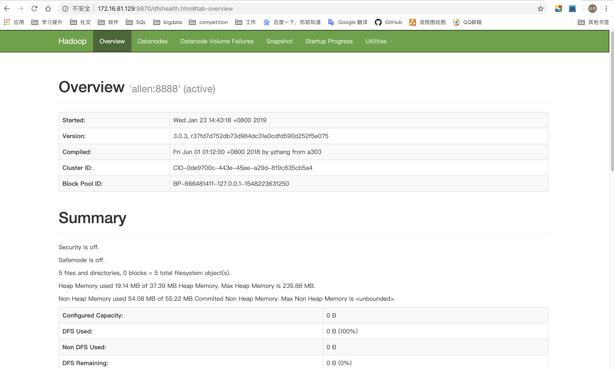

# centos7 hadoop 单机模式安装配置
## 前言
本文主要介绍单机版Hadoop的安装配置，作为学习使用，集群的部署一般用Ambari搭建比较方便，本来想把hadoop和hive的放在一起写，由于太多，就分成两篇写了。
## 1. 首先安装JDK1.8版本
安装方法就不在这里呈现了
## 2. 下载Hadoop
下载地址：http://mirror.bit.edu.cn/apache/hadoop/common/ ，这个是国内的镜像源，自己选个版本下载吧，我下载的是hadoop-3.0.3，跟我们集群上部署的是同一个版本
## 3. 解压Hadoop
根据自己习惯设置解压路径吧，我自己建了个文件夹，解压到指定文件夹了
```sh
# 创建文件夹
mkdir /opt/hadoop
#解压Hadoop
tar -zxvf hadoop-3.0.3.tar.gz  -C /opt/hadoop
```
## 4. 配置hadoop环境变量
```sh
vim /etc/profile
```
```sh
export HADOOP_HOME=/opt/hadoop/hadoop-3.0.3
export PATH=$PATH:$HADOOP_HOME/bin
```
```sh
source /etc/profile
```
## 5. 配置hadoop
### 5.1 配置hadoop-env.sh
```sh
vim /opt/hadoop/hadoop-3.0.3/etc/hadoop/hadoop-env.sh
```
找到# The java implementation to use.将其下面的一行改为：
```sh
export JAVA_HOME=/usr/lib/jdk1.8.0_191
```
### 5.2 配置core-site.xml
```sh
vim /opt/hadoop/hadoop-3.0.3/etc/hadoop/core-site.xml
```
```xml
<configuration>
<property>
        <name>hadoop.tmp.dir</name>
        <value>file:///opt/hadoop/hadoop-3.0.3</value>
        <description>Abase for other temporary directories.</description>
    </property>
    <property>
        <name>fs.defaultFS</name>
        <value>hdfs://172.16.81.129:8888</value>
    </property>
</configuration>
```
其中的IP:172.16.81.129为我的虚拟机的ip，也可以加个映射，单机版的我就没加了。
### 5.3 配置hdfs-site.xml
```sh
vim /opt/hadoop/hadoop-3.0.3/etc/hadoop/hdfs-site.xml
```
```xml
<configuration>
        <property>
        <name>dfs.replication</name>
        <value>1</value>
    </property>
    <property>
        <name>dfs.namenode.name.dir</name>
        <value>file:///opt/hadoop/hadoop-3.0.3/tmp/dfs/name</value>
    </property>
    <property>
        <name>dfs.datanode.data.dir</name>
        <value>file:///opt/hadoop/hadoop-3.0.3/tmp/dfs/data</value>
    </property>
</configuration>
```
## 6. SSH免密码登录配置
这里只配单机的SSH免密登陆
### 6.1 首先运行
```sh
ssh-keygen -t rsa
```
接下来一直默认回车就好
### 6.2 将公钥导入到认证文件中
```sh
cd ~/.ssh
cat id_rsa.pub>>authorized_keys
```
单机版的免密登陆就配置OK了，你可以用ssh localhost测试下
## 7. 增加变量
启动停止hdfs,yarn脚本文件需要修改，增加如下变量，要不会启动失败的
```sh
cd /opt/hadoop/hadoop-3.0.3  
```
**先增加hdfs的变量**
```sh
vim sbin/start-dfs.sh
```
```sh
HDFS_DATANODE_USER=root
HADOOP_SECURE_DN_USER=hdfs
HDFS_NAMENODE_USER=root
HDFS_SECONDARYNAMENODE_USER=root 
```
```sh
vim sbin/stop-dfs.sh
```
```sh
HDFS_DATANODE_USER=root
HADOOP_SECURE_DN_USER=hdfs
HDFS_NAMENODE_USER=root
HDFS_SECONDARYNAMENODE_USER=root 
```
**接下来是yarn的变量**
```sh
vim sbin/start-yarn.sh
```
```sh
YARN_RESOURCEMANAGER_USER=root
HADOOP_SECURE_DN_USER=yarn
YARN_NODEMANAGER_USER=root
```
```sh
vim sbin/stop-yarn.sh
```
```sh
YARN_RESOURCEMANAGER_USER=root
HADOOP_SECURE_DN_USER=yarn
YARN_NODEMANAGER_USER=root
```
## 8. 启动与停止
第一次启动hdfs需要格式化：
```sh
cd /opt/hadoop/hadoop-3.0.3
./bin/hdfs namenode -format
```
```
Re-format filesystem in Storage Directory /opt/hadoop-2.7.5/tmp/dfs/name ? (Y or N)
# 选Y
```
启动：
```sh
./sbin/start-dfs.sh
```
停止：
```sh
./sbin/stop-dfs.sh
```
验证，浏览器输入:http://172.16.81.129:9870


简单的验证hadoop命令：
```sh
hadoop fs -mkdir /test
```
在浏览器查看，出现如下图所示，即为成功


## 9. 配置yarn
### 9.1 配置mapred-site.xml
```sh
cd /opt/hadoop/hadoop-3.0.3/etc/hadoop/
cp mapred-site.xml.template mapred-site.xml
vim mapred-site.xml
```
```xml
<configuration>
    <!-- 通知框架MR使用YARN -->
    <property>
        <name>mapreduce.framework.name</name>
        <value>yarn</value>
    </property>
</configuration>
```
### 9.2 配置yarn-site.xml
```sh
vim yarn-site.xml
```
```xml
<configuration>
    <!-- reducer取数据的方式是mapreduce_shuffle -->
    <property>
        <name>yarn.nodemanager.aux-services</name>
        <value>mapreduce_shuffle</value>
    </property>
</configuration>
```
### 9.3 yarn启动与停止
```sh
cd /opt/hadoop/hadoop-3.0.3
./sbin/start-yarn.sh
```
浏览器查看：http://172.16.81.129:8088


jps查看进程


到此，hadoop单机模式就配置成功了！
