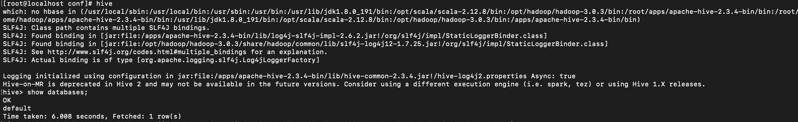

# centos7 hive 单机模式安装配置
## 前言
由于只是在自己的虚拟机上进行学习，所以对hive只是进行最简单的配置，其他复杂的配置文件没有配置
## 1. 前提
### 1.1 安装配置jdk1.8
### 1.2 安装Hadoop2.x以上版本
hadoop单机模式安装见：[centos7 hadoop 单机模式安装配置](https://github.com/zhengyue2018/bigdata_learn/blob/master/centos7%20hadoop%20%E5%8D%95%E6%9C%BA%E6%A8%A1%E5%BC%8F%E5%AE%89%E8%A3%85%E9%85%8D%E7%BD%AE.md)
### 1.3  安装mysql并配置myql允许远程访问，我的mysql版本5.7.23
mysql数据库安装过程请参考：[MySQL5.7安装](https://github.com/zhengyue2018/bigdata_learn/blob/master/MySQL5.7%E5%AE%89%E8%A3%85.md)
## 2.下载Hive
下载地址：http://mirror.bit.edu.cn/apache/hive/ ，我下载的是apache-hive-2.3.4-bin.tar.gz
```sh
wget http://mirror.bit.edu.cn/apache/hive/hive-2.3.4/apache-hive-2.3.4-bin.tar.gz
或者下载到本地，通过工具上传到虚拟机中
```
## 3.解压
解压目录根据自己习惯，我建了个apps的文件夹，解压到这里了
```sh
tar -zxvf apache-hive-2.3.4-bin.tar.gz  -C /apps/
```
## 4.配置hive环境变量
```sh
vim /etc/profile
```
```sh
export HIVE_HOME=/apps/apache-hive-2.3.4-bin
export PATH=$PATH:$HIVE_HOME/bin
```
```sh
source /etc/profile
```
## 5.配置hive
### 5.1 配置hive-site.xml
其中ConnectionUserName和ConnectionPassword为mysql远程访问的用户名和密码，hive_metadata为mysql数据库，随自己习惯命名
```sh
cd /apps/apache-hive-2.3.4-bin/conf/
vim hive-site.xml
```
```xml
<?xml version="1.0" encoding="UTF-8" standalone="no"?>
<?xml-stylesheet type="text/xsl" href="configuration.xsl"?>
<configuration>
 <property>
    <name>javax.jdo.option.ConnectionURL</name>
    <value>jdbc:mysql://localhost:3306/hive_metadata?&amp;createDatabaseIfNotExist=true&amp;characterEncoding=UTF-8&amp;useSSL=false</value>
 </property>
<property>
    <name>javax.jdo.option.ConnectionUserName</name>
    <value>root</value>
</property>
<property>
    <name>javax.jdo.option.ConnectionPassword</name>
    <value>Root-123</value>
</property>
<property>
    <name>javax.jdo.option.ConnectionDriverName</name>
    <value>com.mysql.jdbc.Driver</value>
</property>
<property>
    <name>datanucleus.schema.autoCreateAll</name>
    <value>true</value> </property>
<property>
    <name>hive.metastore.schema.verification</name>
    <value>false</value>
 </property>
</configuration>
```
### 5.2 配置hive-env.sh
```sh
cp hive-env.sh.template hive-env.sh
vim hive-env.sh
```
```sh
HADOOP_HOME=/opt/hadoop/hadoop-3.0.3
export HIVE_CONF_DIR=/apps/apache-hive-2.3.4-bin/conf
```
## 6.加载MySQL驱动
- 下载地址：http://dev.mysql.com/downloads/connector/j/ 
- 我下载的是：mysql-connector-java-5.7.23.tar.gz，解压并将其中的mysql-connector-java-5.7.23-bin.jar放到hive/lib下
- 具体路径为：/apps/apache-hive-2.3.4-bin/lib
## 7.初始化数据库
```sh
schematool -initSchema -dbType mysql
```
## 8.启动hive
启动hive之前先启动hadoop,不然会报Connection refused异常，在命令行jps看一下hadoop是否启动成功然后启动hive
```sh
hive
```
然后简单的测试
```sql
show databases;
```
出现如下图所示即代表配置成功！

